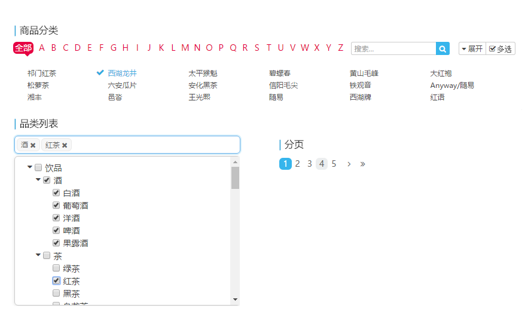
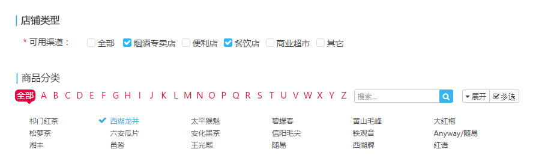
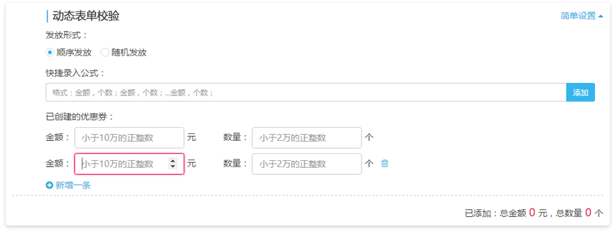

# vue 组件化开发分享

- [ ] 组件思想
- [ ] Vue生命周期与数据生命周期
- [ ] 表单验证

``` bash
├─1.Vue生命周期与数据生命周期
├─2.组件思想
│  ├─refs
│  ├─扁平访问
│  ├─组件嵌套
│  ├─组件界限
│  └─递归组件
└─3.表单验证
    └─动态表单的验证
```

## - [x] 组件思想

> 概念：可重用代码（包括了数据和视图）的封装，使用自定义标签来调用和组织。

#### 组件界限

> 组件分工明确自己的事情自己做，父级不得干涉。

``` html
<Menu> <!-- menu1 -->
  <MenuItem></MenuItem>
  <SubMenu>
    <Menu> <!-- menu2 -->
      <!-- later component ... -->
    </Menu>
  </SubMenu>
</Menu>
```

menu1 只应该关心当前 children 中谁是当前高亮项（active），而不应该关注 SubMenu 是否应该展开子菜单（SubMenu 应该由自己是否是 active 决定是否展开子菜单）

#### 扁平访问

> 组件推荐使用状态来控制交互和显示，如果需要显示访问，也尽量实行扁平访问，即只可以调用其 children 的方法。

例如：分页组件、商品分类组件、树形选择组件等。



* 错误
``` html
<page :total="pages.total" :size="pages.size" :pre.sync="pages.pre" :redirect="false" @click="queryData(pre)"></page>
```

* 正确
``` html
<page :total="pages.total" :size="pages.size" :pre.sync="pages.pre" :redirect="false"></page>
```
``` js
// ...
watch: {
  'pages.pre':(val) => {
    this.queryData(val);
  }
}
// ...
```

虽然这样可以使用，但是对于事件绑定应当在组件内部来完成，而不是外部，父级组件通过对数据进行监听来实现，或者调用组件方法或访问组件自定义事件来实现。

#### 组件嵌套

> 能使用组件嵌套的绝不使用配置

* 错误：
``` html
<tabs :panels="{[{tab:'t1',pane:<a>1</a>}, {tab:'t2',pane:<a>2</a>}]}"/>
```
* 正确：
``` html
<tabs>
  <tab-pane tab="title1" key="2"><a>1</a></tab-pane>
  <tab-pane tab="title2" key="1"><a>2</a></tab-pane>
</tabs>
```

#### refs

> 能使用操作子组件状态完成的事情绝不使用`refs`

#### 递归组件

> 这里只是提一下，用到的不多，但是在处理一些树形结构的数据时会用到，例如树形选择，树形展示等等。

``` html

```

想了一下这里还是不展开讲了比较复杂，可以放到下一期压轴。

## Vue生命周期 与 数据生命周期

> 一次实例一个生命周期，单页应用中组件不会反复实例化页面切换将不会触发生命周期。

所以需要缓存的数据（一次生命周期获取一次数据）要尽可能的独立于组件内部，避免多次调用接口。

例如：店铺类型、商品分类列表等不会频繁更新的数据。


需要每次路由更新的数据绑定在页面根实例组件上，每次路由切换时进行数据的操作（离开清理或进入更新）。
例如：大部分的content。

## 表单验证

为了usecheck和checkview表现的一致以及一定的复用性，建立校验库，和统一的反馈风格。

#### 动态表单de校验
但需要注意的是，*动态表单* （用户操作生成的表单）的校验是一个问题。

例如：优惠券/红包等动态表单的校验。


``` js

```

## 条件渲染

频繁切换切不影响安全。建议使用`v-show`来提高性能。

非频繁切换，或仅仅作为首屏渲染渲染完成不再进行切换，或切换影响安全，建议使用`v-if`。
